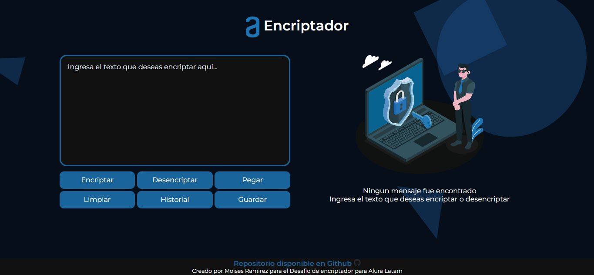

# Encriptador Beta 1.0
Encriptador AluraLatam  
Es un trabajo en progreso...  
https://encriptador.mram.dev/

## Vista previa  

### Se agregan MetaTags  

# 📖Caracterisiticas solicitadas

Las "llaves" de encriptación que se utilizaran son las siguientes:

- La letra **"e"** es convertida para "enter"
- La letra **"i"** es convertida para **"imes"**
- La letra **"a"** es convertida para **"ai"**
- La letra **"o"** es convertida para **"ober"**
- La letra **"u"** es convertida para **"ufat"**

# 🧩Requisitos

Debe funcionar solo con letras minúsculas  
No deben ser utilizados letras con acentos ni caracteres especiales

Debe ser posible convertir una palabra para la versión encriptada también devolver una palabra encriptada para su versión original.

Por ejemplo:
- "gato" => "gaitober"
- gaitober" => "gato"

La página debe tener campos para inserción del texto que será encriptado o desencriptado, y el usuario debe poder escoger entre las dos opciones.

El resultado debe ser mostrado en la pantalla.

# ✅ Extras:

Un botón que copie el texto encriptado/desencriptado para la sección de transferencia, o sea que tenga la misma funcionalidad del ctrl+C o de la opción "copiar" del menú de las aplicaciones.

# Funciones adicionales agregadas  

|  Estado  |  Funcion  |
|  -------------  |  -------------  |
|  ✅  |  Modo espejo Textarea dinamica (Solo aparece si detecta texto)  |
|  ✅  |  Agregado el boton restablecer area de trabajo, evita recargar la pagina |  
|  ✅  |  Agregado boton para pegar texto |
|  ✅  |  Agregada notificaciones tipo toast |

# ❓Funciones en desarrollo

|  Estado | Funcion                                 |
|  -------------  |-----------------------------------------|
|  ❓ | Contador de palabras encriptadas*       |
|  ❓ | Historial para guardar sesiones         |
|  ❓ | Restablecer historial con un solo click |
|  ❓ | Poder eliminar sesiones guardadas       | 
|  ❓ | Agregar responsividad                   | 
|  ❓ | Medidor de LocalStorage para sesiones   |

