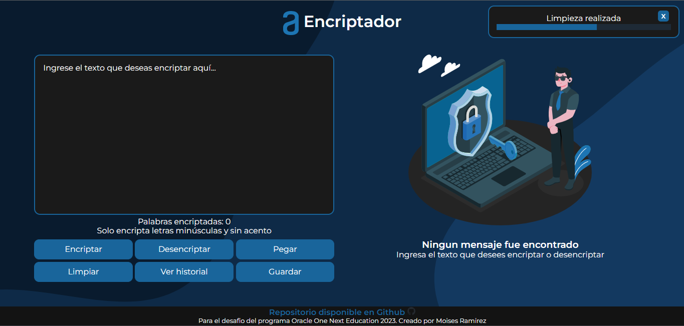
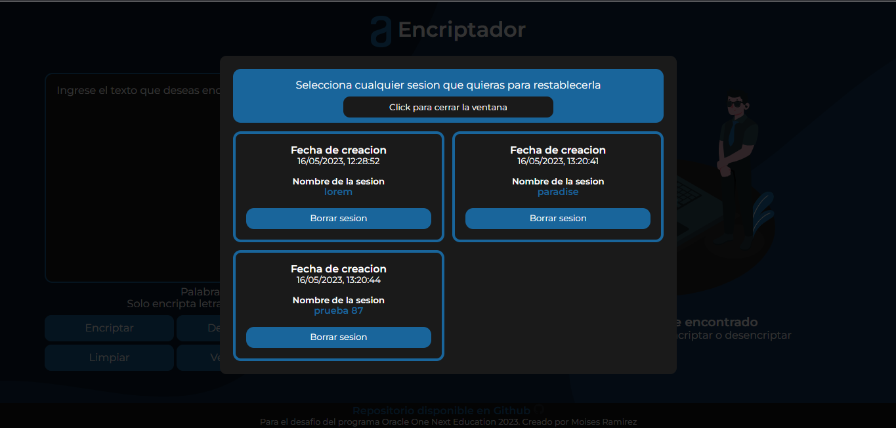
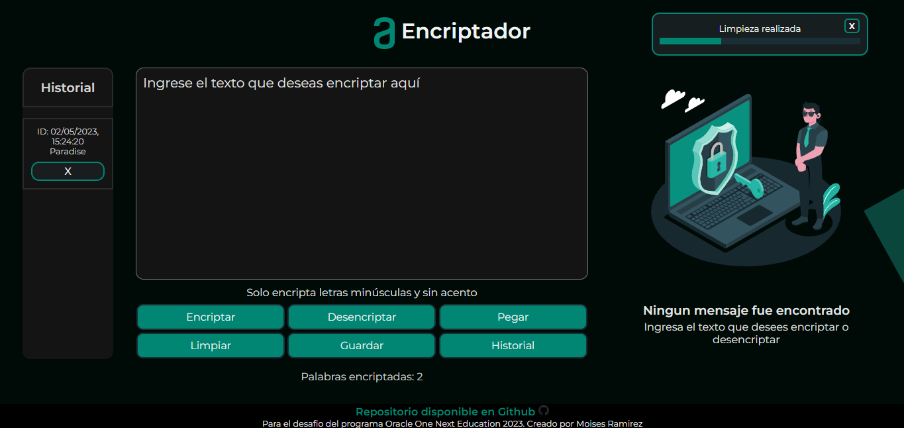

# 💾Encriptador Version Beta 3.0 
Para probar el encriptador ingresa. Todavia es un trabajo en progreso...  
https://elhombrepan.github.io/Encriptador/ 

## Version antigua
    
Para el programa ORACLE ONE NEXT EDUCATION    
https://www.oracle.com/mx/education/oracle-next-education/

    
    
    

  

# 📖Caracterisiticas solicitadas

Las "llaves" de encriptación que se utilizaran son las siguientes:

- La letra **"e"** es convertida para "enter"  
- La letra **"i"** es convertida para **"imes"**  
- La letra **"a"** es convertida para **"ai"**  
- La letra **"o"** es convertida para **"ober"**  
- La letra **"u"** es convertida para **"ufat"**  

# 🧩Requisitos  

Debe funcionar solo con letras minúsculas  
No deben ser utilizados letras con acentos ni caracteres especiales  

Debe ser posible convertir una palabra para la versión encriptada también devolver una palabra encriptada para su versión original.

Por ejemplo:  
- "gato" => "gaitober"  
- gaitober" => "gato"  

La página debe tener campos para inserción del texto que será encriptado o desencriptado, y el usuario debe poder escoger entre las dos opciones.

El resultado debe ser mostrado en la pantalla.  

# ✅ Extras:

Un botón que copie el texto encriptado/desencriptado para la sección de transferencia, o sea que tenga la misma funcionalidad del ctrl+C o de la opción "copiar" del menú de las aplicaciones.

# Funciones adicionales agregadas  

|  Estado  |  Funcion  |
|  -------------  |  -------------  |
|  ✅  |  Modo espejo para las cajas de texto  |
|  ✅  |  Textarea dinamica (Solo aparece si detecta texto)  |
|  ✅  |  Agregado el boton restablecer area de trabajo, evita recargar la pagina  |  
|  ✅  |  Agregado boton para pegar texto  |
|  ✅  |  Agregada notificaciones tipo toast  |  
|  ✅  |  Agregado un contador de palabras encriptadas*   |
|  ✅  |  Agregado Historial   |
|  ✅  |  Restablecer historial con un solo click   |
|  ✅  |  Eliminar sesiones previas   | 

*Solo contara la palabra si contiene por lo menos una letra de la llaves,  
**Por el momento con algunas limitantes

# ❓Funciones en desarrollo  

|  Estado  |  Funcion  |
|  -------------  |  -------------  |
|  ❓ |  Trabajando en modo responsivo  |
|  ❓ |  Trabajando en medidor de almacenamiento dinamico  |
|  ❓ |  Trabajando en selector de temas  |

